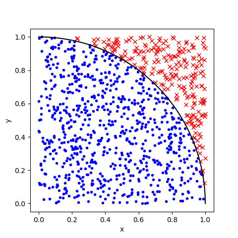
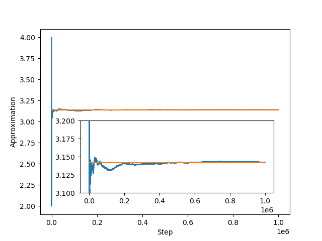

# funny_maths (DRAFT)

> DRAFT, to be updated in the next days

A collection of funny and/or interesting math projects

# Approximating $\pi$

There are numerous ways to approximate pi. We will have a look at some of them.

## Evolution of the approximation

