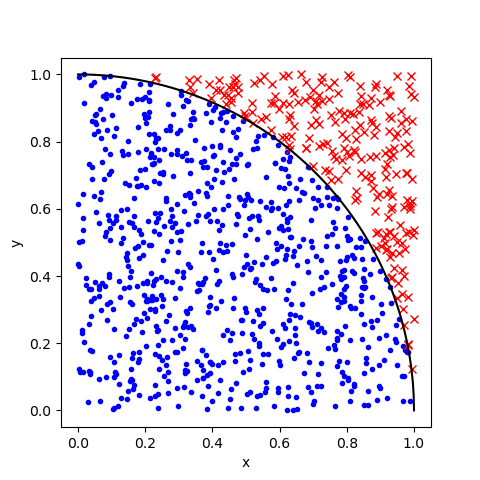
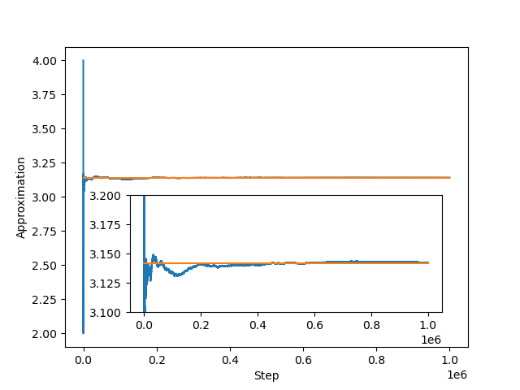
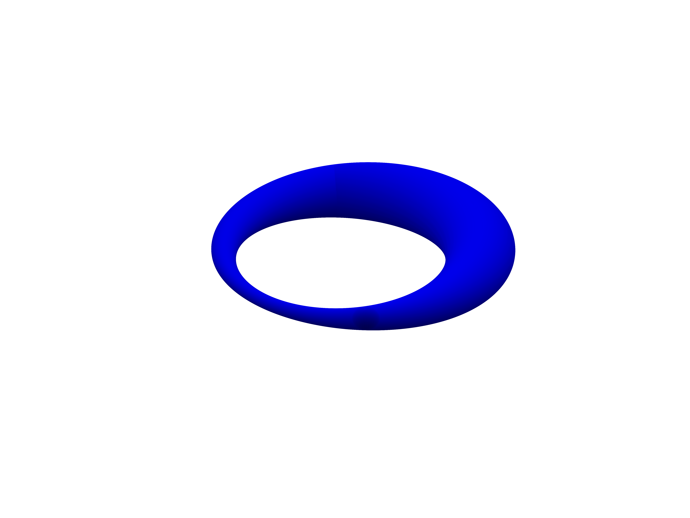

# funny_maths (DRAFT)

> DRAFT, to be updated in the next days

A collection of funny and/or interesting math projects

Table of contents
=================

   * [Approximating pi](#approximating)
   * [Dupin cyclides](#dupin-cyclides)

# Approximating 

There are numerous ways to approximate pi. We will have a look at some of them.

### Evolution of the approximation

# Dupin cyclides

A [Dupin cyclide](https://en.wikipedia.org/wiki/Dupin_cyclide) is the envelope of a set of spheres that is in continuous contact with three spheres, e.g. a surface in three-dimensional space.
There are different types like horn cyclides, ring cyclides or even parabolic cyclides.
For more information please have a look at [wikipedia](https://en.wikipedia.org/wiki/Dupin_cyclide#Parametric_and_implicit_representation) for now.

In the beginning of 2020 I wrote a little script to generate plots of dupin cyclides.
However, instead of the envelope there are just many spheres overlapping.

> :warning: Please feel free to optimize the code, write some nice improvements or even change to the plot of the envelope instead of all the spheres. The code is quite unoptimized as I wrote it years ago.

